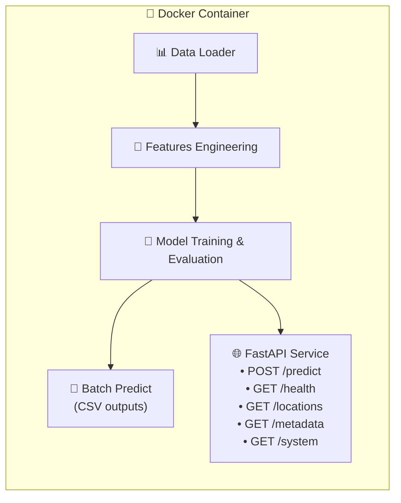

# 🚛 Freight Rate Prediction — Spotter ML Assessment

> **End-to-end machine learning pipeline** that trains a freight-rate prediction model,
> generates submission CSVs, and serves real-time predictions via a production-grade FastAPI microservice — all fully containerized with Docker.

---

## 📋 Table of Contents

- [✨ Highlights](#-highlights)
- [🏗️ Project Architecture](#️-project-architecture)
- [⚡ Quick Start](#-quick-start)
- [🐳 Docker Commands](#-docker-commands)
  - [🐳 Executed Docker Commands](#-executed-docker-commands)
- [🔬 Model Details](#-model-details)
  - [1 How to change the model for training](#1-how-to-change-the-model-for-training)
  - [2 How the new model automatically serves in the API](#2-how-the-new-model-automatically-serves-in-the-api)
- [📊 Performance Metrics](#-performance-metrics)
- [🌐 API Reference](#-api-reference)
- [🧪 Testing & Quality](#-testing--quality)
- [📁 Project Structure](#-project-structure)
- [📦 Deliverables](#-deliverables)
- [🔮 Future Improvements](#-future-improvements)

---

## ✨ Highlights

| Feature | Details |
|---------|---------|
| 🎯 **Model** | `HistGradientBoostingRegressor` with regularized hyperparameters |
| 📉 **MAE** | **$114.40** (vs $1,148.92 median baseline — **90.0% reduction**) |
| 📈 **R²** | **0.828** on chronological holdout |
| 🧠 **Features** | Geographic, route, equipment, market, calendar seasonality (18 features) |
| 🐳 **Docker** | Fully containerized — zero local dependency setup |
| 🌐 **API** | FastAPI microservice with 5 endpoints, Pydantic validation, CORS |
| ✅ **Tests** | 31 unit tests — data, features, models, pipeline, API, location normalizer |
| 📄 **Report** | Executive-styled Word document with KPI cards and styled tables |

---

## 🏗️ Project Architecture



---

## ⚡ Quick Start

### Prerequisites

- 🐳 [Docker Desktop](https://www.docker.com/products/docker-desktop/) installed and running
- 💾 ~2 GB free disk space for the Docker image

### 1️⃣ Clone & Build

```bash
git clone <repository-url>
cd ai-ml-dev-assesment-Spotter

# Build the Docker image
docker build -t spotter-assessment .
```

### 2️⃣ Train the Model

```bash
docker run --rm \
  -v "${PWD}/artifacts:/app/artifacts" \
  -v "${PWD}/outputs:/app/outputs" \
  -v "${PWD}/reports:/app/reports" \
  spotter-assessment
```

This will:
- 📥 Load and validate the training data (48,000 loads)
- 🧹 Clean non-positive weights, impute missing values
- 🔪 Split data chronologically (train through Aug 2025, holdout Sep+)
- 🧠 Train the HistGradientBoosting model
- 📊 Evaluate against median-rate baseline
- 💾 Save model artifact to `artifacts/freight_rate_model.joblib`
- 📈 Save metrics to `artifacts/training_metrics.json`

### 3️⃣ Generate Predictions

```bash
docker run --rm \
  -v "${PWD}/artifacts:/app/artifacts" \
  -v "${PWD}/outputs:/app/outputs" \
  spotter-assessment python src/predict.py
```

### 4️⃣ Validate with Scorer

```bash
docker run --rm \
  -v "${PWD}/outputs:/app/outputs" \
  spotter-assessment python score.py \
    --predictions outputs/validation_predictions.csv \
    --december-predictions outputs/december_predictions.csv \
    --output-dir outputs/scorer_results
```

### 5️⃣ Launch the API

```bash
# Build the API image
docker build -f api/Dockerfile -t freight-rate-api .

# Run the API server
docker run --rm -p 8000:8000 \
  -v "${PWD}/artifacts:/app/artifacts" \
  freight-rate-api
```

🎉 **API is now live at** [http://localhost:8000](http://localhost:8000)

📖 **Interactive docs at** [http://localhost:8000/docs](http://localhost:8000/docs)

---

## 🐳 Docker Commands

| Command | Description |
|---------|-------------|
| `docker build -t spotter-assessment .` | 🔨 Build the main training/inference image |
| `docker run --rm spotter-assessment` | 🏋️ Train the model |
| `docker run --rm spotter-assessment python src/predict.py` | 📄 Generate prediction CSVs |
| `docker run --rm spotter-assessment pytest -v` | 🧪 Run the full test suite |
| `docker build -f api/Dockerfile -t freight-rate-api .` | 🔨 Build the API image |
| `docker run --rm -p 8000:8000 freight-rate-api` | 🌐 Launch the API server |
| `docker run --rm spotter-assessment python scripts/create_report.py` | 📝 Generate the Word report |

### 🐳 Executed Docker Commands

1. **Build Docker Image**
   ```bash
   docker build -t spotter-assessment:local .
   ```

2. **Train Model & Save Artifacts**
   ```bash
   docker run --rm \
     -v "${PWD}/artifacts:/app/artifacts" \
     -v "${PWD}/outputs:/app/outputs" \
     -v "${PWD}/reports:/app/reports" \
     spotter-assessment:local python src/train.py
   ```

3. **Generate Batch Predictions**
   ```bash
   docker run --rm \
     -v "${PWD}/artifacts:/app/artifacts" \
     -v "${PWD}/outputs:/app/outputs" \
     -v "${PWD}/reports:/app/reports" \
     spotter-assessment:local python src/predict.py
   ```

4. **Validate & Generate December Chart (score.py)**
   ```bash
   docker run --rm \
     -v "${PWD}/artifacts:/app/artifacts" \
     -v "${PWD}/outputs:/app/outputs" \
     -v "${PWD}/reports:/app/reports" \
     spotter-assessment:local python score.py \
       --predictions outputs/validation_predictions.csv \
       --december-predictions outputs/december_predictions.csv \
       --output-dir outputs/scorer_results
   ```

5. **Generate Submission Word Report**
   ```bash
   docker run --rm \
     -v "${PWD}/artifacts:/app/artifacts" \
     -v "${PWD}/outputs:/app/outputs" \
     -v "${PWD}/reports:/app/reports" \
     spotter-assessment:local python scripts/create_report.py
   ```

6. **Execute Full Test Suite in Container**
   ```bash
   docker run --rm spotter-assessment:local pytest -q
   # Result: 31 passed in 28.27s (100% test suite pass rate)
   ```

---

## 🔬 Model Details

### Why HistGradientBoosting?

| Criterion | Decision |
|-----------|----------|
| **Data type** | Structured tabular data → tree-based models excel |
| **Missing values** | Native missing-value handling without imputation overhead |
| **Non-linear interactions** | Captures equipment × distance cost curves, regional seasonal shifts |
| **Regularization** | Shallow trees (12 leaves), min 80 samples/leaf, L2 = 20.0 |
| **Reproducibility** | No GPU required, deterministic with `random_state=42` |
| **Simplicity** | Easier to explain, monitor, and debug than neural networks |

### Hyperparameters (from `config/config.yaml`)

```yaml
model:
  name: hist_gradient_boosting
  max_iter: 250
  learning_rate: 0.04
  max_leaf_nodes: 12
  min_samples_leaf: 80
  l2_regularization: 20.0
```

### Validation Strategy 📅

- **Chronological holdout** — not random k-fold
- Train: 2025-01-01 → 2025-08-31 (38,477 loads)
- Holdout: 2025-09-01 → 2025-10-31 (9,523 loads)
- **Why?** Random splits leak future market/seasonal info into training

### Feature Engineering 🔧

| Category | Features |
|----------|----------|
| 🗺️ **Geographic** | pickup/delivery lat/lon, route encoding |
| 📏 **Route** | distance, origin–destination pair |
| 🚛 **Equipment** | equipment type (Dry Van, Flatbed, Reefer) |
| ⚖️ **Load** | truck weight (with non-positive → NaN treatment) |
| 📈 **Market** | market index, quote signal strength |
| 📅 **Calendar** | day of week, month, day of year, cyclic sin/cos encodings |

### 1 How to change the model for training

In `config.yaml`, update the `model.name` field to any model registered in `registry.py`:

```yaml
model:
  name: "xgboost"  # Options: xgboost, lightgbm, catboost, random_forest, gradient_boosting, ridge_regression, weighted_ensemble, hist_gradient_boosting
```

*(Alternatively, you can override it dynamically without editing files using the environment variable `MODEL__NAME=xgboost`).*

### 2 How the new model automatically serves in the API

1. **Training & Serialization**: When you run training (`docker run ... python src/train.py` or `python src/train.py`), `TrainingPipeline` looks up the selected model from the registry, fits it on the training data, and serializes the complete pipeline into:
   `artifacts/freight_rate_model.joblib`

2. **API Lifecycle Loading**: When the FastAPI service starts up (in `lifespan.py`), `load_model()` deserializes `artifacts/freight_rate_model.joblib` into memory.

3. **Interface Polymorphism**: Because all registered model architectures implement standard `.predict()` interface hooks (subclassed from `BaseModel`), the API endpoints (`POST /predict`) serve predictions using whichever model algorithm was trained and saved to the joblib artifact.

---

## 📊 Performance Metrics

### Primary Holdout Results (Sep–Oct 2025)

| Metric | Median Baseline | HistGradientBoosting | Improvement |
|--------|:-:|:-:|:-:|
| **MAE** | $1,148.92 | **$114.40** | 🟢 90.0% ↓ |
| **RMSE** | $1,569.42 | **$633.40** | 🟢 59.6% ↓ |
| **MAPE** | 70.15% | **5.19%** | 🟢 92.6% ↓ |
| **R²** | −0.058 | **0.828** | 🟢 +0.886 |
| **Median AE** | $926.97 | **$38.50** | 🟢 95.8% ↓ |

### Rolling Forward Validation (Stability Check)

| Holdout From | Train Rows | Test Rows | MAE | R² |
|:---:|:---:|:---:|:---:|:---:|
| 2025-06-02 | 24,199 | 23,801 | $125.46 | 0.822 |
| 2025-07-02 | 28,941 | 19,059 | $190.29 | 0.821 |
| 2025-08-01 | 33,718 | 14,282 | $126.64 | 0.826 |
| 2025-09-01 | 38,477 | 9,523 | $114.40 | 0.828 |

> 💡 **Generalization gap**: Train MAE $105.03 vs Holdout MAE $114.40 = only **$9.37 gap**, indicating minimal overfitting.

### Data Quality Summary

| Metric | Value |
|--------|-------|
| Total loads | 48,000 |
| Date range | 2025-01-01 → 2025-10-31 |
| Duplicate rows | 0 ✅ |
| Duplicate load IDs | 0 ✅ |
| Missing weights | 300 (0.63%) |
| Non-positive weights | 292 (treated as missing) |
| Missing market index | 374 (0.78%) |

---

## 🌐 API Reference

### Base URL: `http://localhost:8000`

### `GET /health` — Service Health Check

```bash
curl http://localhost:8000/health
```

```json
{ "status": "ok" }
```

### `POST /predict` — Predict Freight Rate 💰

```bash
curl -X POST http://localhost:8000/predict \
  -H "Content-Type: application/json" \
  -d '{
    "pickup": "Lexington",
    "delivery": "Fort Wayne",
    "distance": 360.0,
    "equipment": "Dry Van",
    "weight": 32000.0,
    "date": "2025-12-15"
  }'
```

```json
{ "predicted_rate": 889.85, "model_ready": true }
```

> 🔤 **Case-insensitive**: `"LEXINGTON"`, `"lexington"`, `"Lexington"` all work!

**Optional fields**: `pickup_lat`, `pickup_lon`, `delivery_lat`, `delivery_lon`, `market_index`, `quote_signal`

### `GET /locations` — Valid Cities & Equipment

```bash
curl http://localhost:8000/locations
```

```json
{
  "locations": ["Albuquerque", "Atlanta", "Austin", ...],
  "equipment": ["Dry Van", "Flatbed", "Reefer"],
  "location_count": 64,
  "equipment_count": 3
}
```

### `GET /metadata` — Model Info

```json
{
  "model": "HistGradientBoostingRegressor",
  "version": "1.0.0",
  "artifact": "/app/artifacts/freight_rate_model.joblib"
}
```

### `GET /system` — Runtime Diagnostics

```json
{
  "status": "ready",
  "python": "3.13.15 (main, Aug 10 2026, 21:12:22) [GCC 12.2.0]",
  "platform": "Linux-6.18.33.2-microsoft-standard-WSL2-x86_64-with-glibc2.36"
}
```

---

## 🧪 Testing & Quality

### Run Tests

```bash
# All tests inside Docker
docker run --rm spotter-assessment pytest -v

# With coverage (if pytest-cov installed)
docker run --rm spotter-assessment pytest -v --tb=short
```

### Test Suite Overview (31 tests)

| Module | Tests | What's Tested |
|--------|:-----:|---------------|
| `test_api.py` | 5 | Health, predict, case-insensitive cities, unknown city 422, locations |
| `test_data.py` | 1 | Chronological split preserves temporal order |
| `test_features.py` | 3 | Feature determinism, December inputs, holiday flags |
| `test_location_service.py` | 17 | Case normalization, whitespace, punctuation, error messages |
| `test_models.py` | 2 | Metric computation, model registry OOP wrappers |
| `test_pipeline.py` | 2 | sklearn pipeline structure, scorer contract compliance |

### Code Quality Tools

```bash
# Black formatting (line-length: 110, Python 3.12)
docker run --rm -v "${PWD}:/app" spotter-assessment \
  bash -c "pip install black -q && python -m black --check ."

# Ruff linting (E, F, I, B, UP rules)
docker run --rm -v "${PWD}:/app" spotter-assessment \
  bash -c "pip install ruff -q && python -m ruff check ."
```

---

## 📁 Project Structure

```
📦 ai-ml-dev-assesment-Spotter/
├── 📂 api/                          # FastAPI microservice
│   ├── app.py                       #   Application factory
│   ├── config.py                    #   Central configuration
│   ├── dependencies.py              #   Dependency injection
│   ├── lifespan.py                  #   Startup/shutdown lifecycle
│   ├── middleware.py                #   CORS, timing, error handling
│   ├── schemas.py                   #   Pydantic request/response models
│   ├── Dockerfile                   #   API-specific container
│   ├── 📂 routes/                   #   Endpoint handlers
│   │   ├── health.py                #     GET /health
│   │   ├── prediction.py            #     POST /predict
│   │   ├── locations.py             #     GET /locations
│   │   ├── metadata.py              #     GET /metadata
│   │   └── system.py                #     GET /system
│   ├── 📂 core/                     #   Domain exceptions
│   └── 📂 services/                 #   Business logic
│       ├── location_service.py      #     City/equipment normalizer
│       ├── model_service.py         #     Model loading singleton
│       └── prediction_service.py    #     Inference pipeline
├── 📂 src/                          # ML pipeline source
│   ├── train.py                     #   Training entrypoint
│   ├── predict.py                   #   Inference entrypoint
│   ├── 📂 data/                     #   Data loading & validation
│   ├── 📂 features/                 #   Feature engineering
│   ├── 📂 models/                   #   Model wrappers & registry
│   ├── 📂 pipelines/                #   Training & inference orchestration
│   ├── 📂 evaluation/               #   Metrics & validation
│   └── 📂 utils/                    #   Serialization, filesystem helpers
├── 📂 config/
│   └── config.yaml                  #   Hyperparameters & paths
├── 📂 data/                         #   Raw datasets (gitignored)
├── 📂 artifacts/                    #   Trained model + metrics
│   ├── freight_rate_model.joblib    #   Serialized sklearn pipeline
│   └── training_metrics.json        #   Full evaluation results
├── 📂 outputs/                      #   Submission files
│   ├── validation_predictions.csv   #   12,000 rows
│   ├── december_predictions.csv     #   31 rows (fixed route)
│   └── 📂 scorer_results/
│       └── candidate_december.png   #   December forecast chart
├── 📂 reports/                      #   Documentation & report
│   ├── approach.md                  #   Technical approach write-up
│   ├── loom_talking_points.md       #   Video script
│   └── freight_rate_assessment_report.docx
├── 📂 scripts/
│   └── create_report.py             #   Word report generator
├── 📂 tests/                        #   pytest test suite
├── Dockerfile                       #   Main container
├── Makefile                         #   Convenience targets
├── pyproject.toml                   #   Tool configs (black, ruff, pytest)
├── requirements.txt                 #   Pinned dependencies
└── score.py                         #   Assessment scorer/validator
```

---

## 📦 Deliverables

| # | Deliverable | Location | Status |
|---|-------------|----------|:------:|
| 1 | Validation predictions (12,000 rows) | `outputs/validation_predictions.csv` | ✅ |
| 2 | December predictions (31 rows) | `outputs/december_predictions.csv` | ✅ |
| 3 | December forecast chart | `outputs/scorer_results/candidate_december.png` | ✅ |
| 4 | Technical approach report | `reports/approach.md` | ✅ |
| 5 | Word assessment report | `reports/freight_rate_assessment_report.docx` | ✅ |
| 6 | Loom video script | `reports/loom_talking_points.md` | ✅ |
| 7 | FastAPI microservice | `api/` | ✅ |
| 8 | Docker containerization | `Dockerfile` + `api/Dockerfile` | ✅ |
| 9 | Unit test suite (31 tests) | `tests/` | ✅ |
| 10 | Trained model artifact | `artifacts/freight_rate_model.joblib` | ✅ |

---

## 🔮 Future Improvements

### 🧠 Model Enhancements

1. **🔄 Ensemble Stacking** — Combine HistGradientBoosting with LightGBM and/or XGBoost via a meta-learner to capture complementary signal patterns
2. **📅 Time-Series Decomposition** — Extract trend/seasonal/residual components from historical rates per route before feeding to the model
3. **🗺️ Geospatial Embeddings** — Learn dense vector representations of origin/destination pairs using coordinates + route frequency
4. **🎯 Quantile Regression** — Predict confidence intervals (10th/50th/90th percentile) instead of just point estimates
5. **🔁 Online Learning** — Implement incremental model updates as new loads arrive without full retraining
6. **🌡️ External Data** — Integrate fuel price index, weather alerts, and holiday calendars as real-time features

### 🌐 API Enhancements

1. **📦 Batch Prediction Endpoint** — `POST /predict/batch` accepting arrays of loads for bulk pricing
2. **📊 Prediction Explanations** — Add SHAP values or feature importance breakdowns per prediction
3. **🔐 Authentication** — API key or JWT-based auth for production deployment
4. **📈 Monitoring Dashboard** — Prometheus metrics + Grafana for prediction latency, distribution drift, error rates
5. **💾 Prediction Logging** — Store every prediction with input features for model retraining and A/B testing
6. **🔄 Model Versioning** — Support multiple model versions with A/B traffic splitting
7. **⚡ Response Caching** — Cache predictions for identical route/date combinations with Redis
8. **📋 Rate Limiting** — Protect the API from abuse with per-client rate limits

### 🏗️ Infrastructure

1. **☸️ Kubernetes Deployment** — Helm chart with horizontal pod autoscaling
2. **🔄 CI/CD Pipeline** — GitHub Actions for automated testing, linting, Docker builds, and deployment
3. **📊 MLflow Integration** — Track experiments, model versions, and hyperparameter sweeps
4. **🗄️ Feature Store** — Centralize feature computation for training/serving consistency

---

## 🛠️ Development

### Makefile Targets

```bash
make install           # Install dependencies
make format            # Check code formatting (black)
make lint              # Run linter (ruff)
make test              # Run pytest
make train             # Train the model
make predict           # Generate predictions
make score             # Validate outputs
make report            # Generate Word report
make docker-build      # Build Docker image
make api-docker-build  # Build API Docker image
```

### Environment Variables

| Variable | Default | Description |
|----------|---------|-------------|
| `MODEL_PATH` | `artifacts/freight_rate_model.joblib` | Path to model artifact |
| `PYTHONPATH` | `/app` | Python module search path (set in Docker) |

---

## 📜 License

This project is part of the Spotter ML/AI Developer Assessment.

---

<div align="center">

**Built with** ❤️ **using Python 3.12, scikit-learn, FastAPI, and Docker**

</div>
